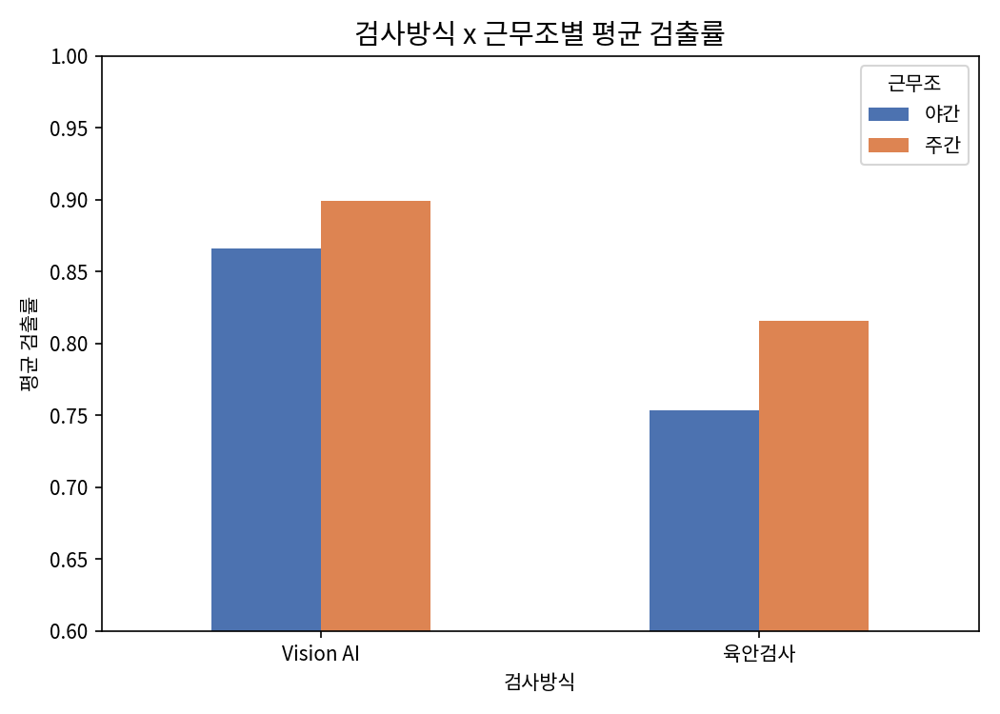
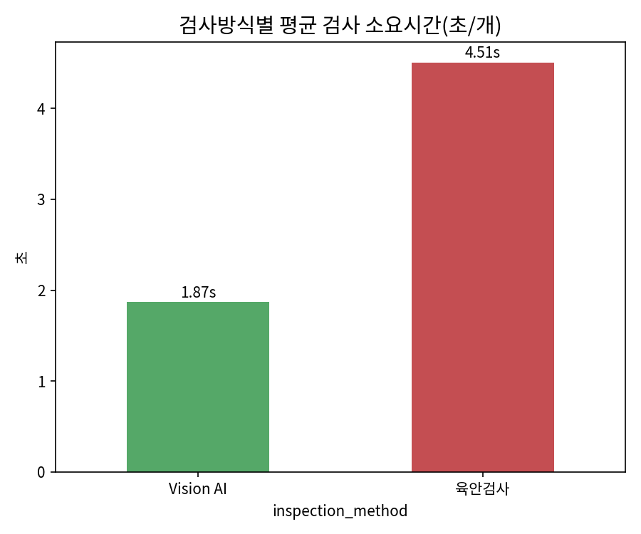
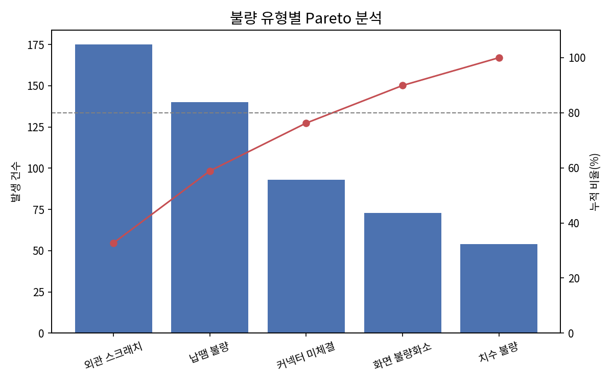
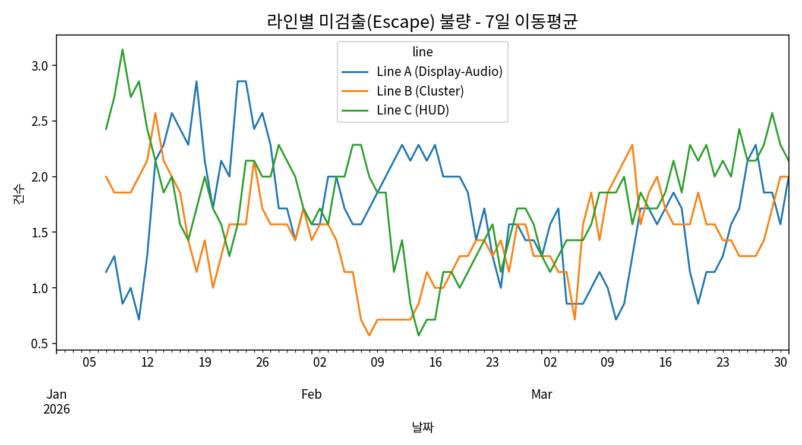

# 미니 데이터 분석: 검사 데이터 표준화 시뮬레이션

> ⚠️ **중요**: 아래 데이터는 현대모비스의 실제 내부 데이터가 아닙니다.
> `02_process-analysis`, `04_solution-mapping`에서 세운 As-Is 가정(육안검사 의존,
> 일부 라인 Vision AI 파일럿 도입 등)을 반영하여 **합리적으로 시뮬레이션한 합성 데이터**입니다.
> 목적은 "검사 데이터가 표준화·통합되면 어떤 인사이트가 도출될 수 있는지"를
> 직접 보여주는 것이며, PP1~PP3 Pain Point의 가설을 데이터로 시각화한 것입니다.

## 데이터 개요
- 기간: 90일 (2026-01-01 ~ 2026-03-31, 가정)
- 대상 라인: Line A(Display-Audio), Line B(Cluster), Line C(HUD)
- 근무조: 주간 / 야간
- 검사방식: 육안검사 / Vision AI (라인별 도입 비율 상이하게 가정 — PP1 가정 반영)
- 총 레코드: 540건 (라인 x 근무조 x 90일)

## 분석 1. 검사방식 x 근무조별 검출률

**인사이트**:
- Vision AI 평균 검출률: **88.3%** vs 육안검사 평균 **78.5%**
- 육안검사는 근무조 간 편차가 뚜렷함: 주간 **81.5%** vs 야간 **75.3%** (약 6%p 차이)
- Vision AI는 근무조 관계없이 안정적인 검출률 유지
- → **PP1 가설("검사자 피로도에 따른 검출률 편차") 이 시뮬레이션 상 뒷받침됨**

## 분석 2. 검사방식별 평균 소요시간

**인사이트**:
- 육안검사 평균 **4.51초/개** vs Vision AI 평균 **1.87초/개** (약 2.4배 차이)
- 검사 속도 개선은 검출률 향상과 별개로 **생산성(Throughput) 측면의 추가 효과**로 제시 가능

## 분석 3. 불량 유형별 Pareto 분석

**인사이트**:
- 상위 2개 불량 유형(외관 스크래치, 납땜 불량)이 전체의 약 60%를 차지하는 것으로 가정된 분포
- → PP2(데이터 표준화)로 이런 유형별 집계가 가능해지면, **불량 유형별 맞춤 개선(예: 외관은 Vision AI, 납땜은 별도 정밀검사)** 우선순위 논리를 세울 수 있음

## 분석 4. 라인별 미검출(Escape) 불량 추이

**인사이트**:
- 전체 시뮬레이션 기간 중 실제 불량(2,499건) 대비 미검출(451건, 약 18%)이 발생하는 것으로 가정
- 미검출 불량은 다음 공정이나 고객단에서 발견될 리스크로 이어짐 → PP1 솔루션(Vision AI 확산)의 정량적 효과 근거로 활용 가능

## 종합 결론 (제안서 연결 포인트)
1. **PP2(데이터 표준화)가 선행되어야** 위와 같은 분석 자체가 가능해짐 → Quick Win 우선순위 근거 강화
2. **PP1(Vision AI 확산)의 기대효과를 정량적으로 제시 가능**: 검출률 +9.8%p, 검사시간 -58% (시뮬레이션 기준)
3. Escape 불량 감소는 후공정 재작업 비용, 고객 클레임 리스크 감소로 이어짐 → 최종 제안서의 "기대효과" 섹션 핵심 근거로 활용

## 한계 및 주의사항
- 본 데이터는 실제 관측치가 아닌 시뮬레이션이며, 실제 수치는 다를 수 있음
- 실제 프로젝트라면 이 단계에서 실제 MES/검사장비 로그 데이터 연동이 필요
- 본 분석의 목적은 "데이터 표준화가 없으면 이런 분석 자체가 불가능하다"는 점과, "표준화 이후 가능한 분석의 형태"를 보여주는 데 있음
